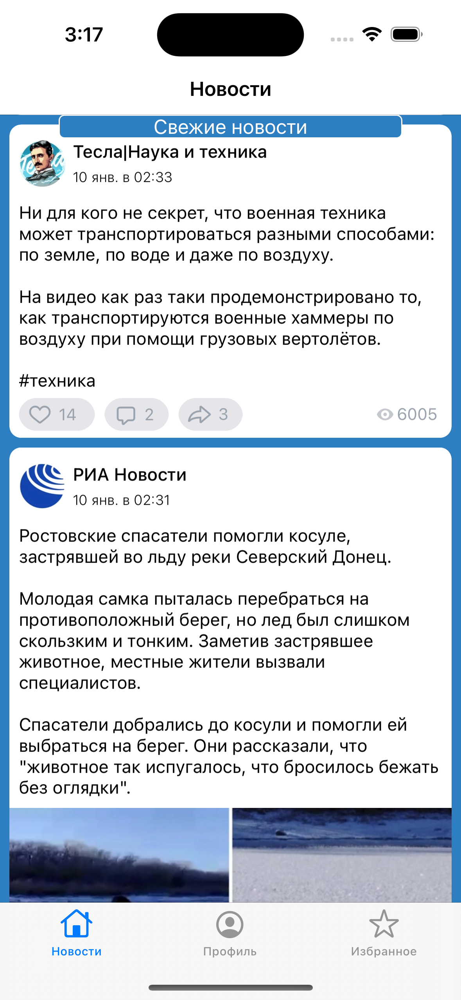
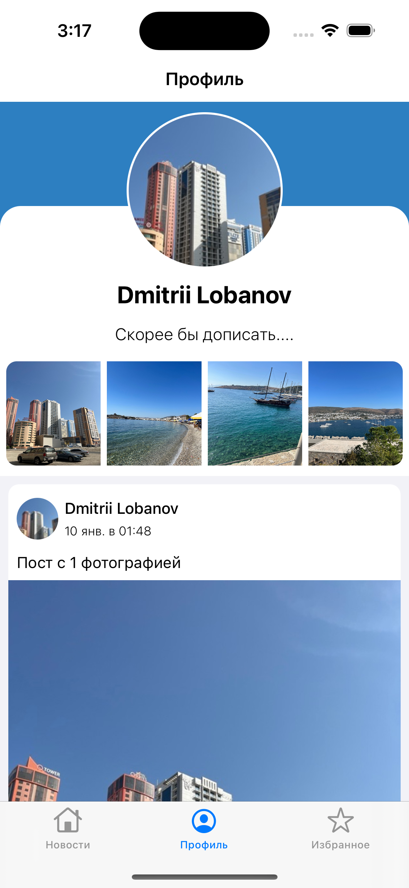
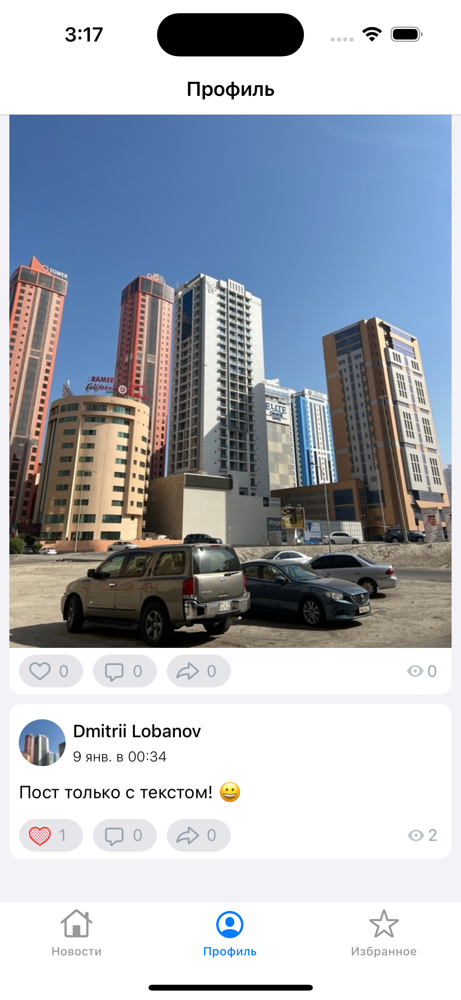
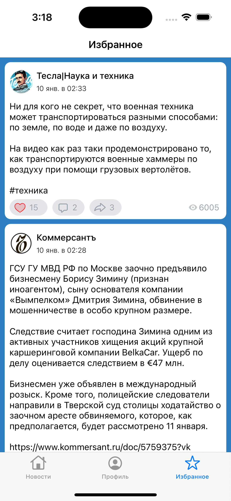

# iOS_diplom_VK_App

### Установка
1. brew install carthage 
2. В папке проекта выполнить
- Carthage update --platform ios --use-xcframeworks

Для работы приложения необходимо создать Standalone-приложение тут https://vk.com/apps?act=manage

ID приложения необходимо поместить в info.plist, а так же в конфиг Services\API.swift

### Стэк
1. API: SDK VK
2. Верстка: [Tiny Constraints](https://github.com/roberthein/TinyConstraints)
3. Архитектура - Clean Swift (VIP)
4. RealmSwift

### Реализованные функции
1. Лента новостей пользователя.
- На данный момент поддерживаются посты с текстом и фотографиями. Если пост содержит несколько фотографий - в приложении отображается только первое.
- Сохранение последнего просмотренного поста (при перезагрузке приложения на экране показывает пост, на котором пользователь остановился).
- Подсветка наличия непрочитанных постов.
- Кнопка "лайк" - при нажатии на нее в пост добавляется/убирается лайк и пост добавляется/удаляется в/из раздел(а) Избранное.

2. Страница профиля пользователя.
- На данный момент поддерживаются только 2 типа постов: пост с текстом и пост с 1 фотографией и текстом.
- Обновление данных происходит при каждом открытии раздела Профиль.
- При нажатии на "плашку" фотографий открывается весь список фото.

  

3. Раздел Избранное.
- при удалении "лайка" с поста, он автоматически удаляется из Избранного.

4. Добавлена локализация:
- русская
- английская
